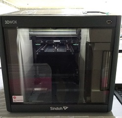
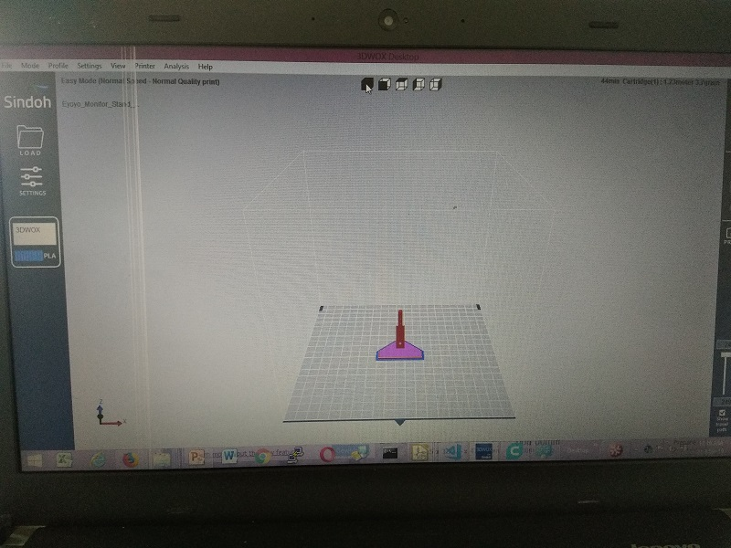
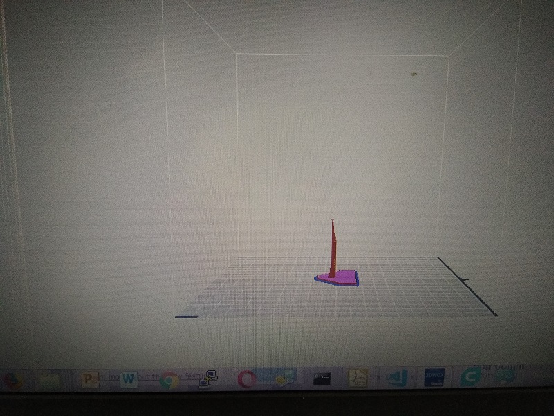
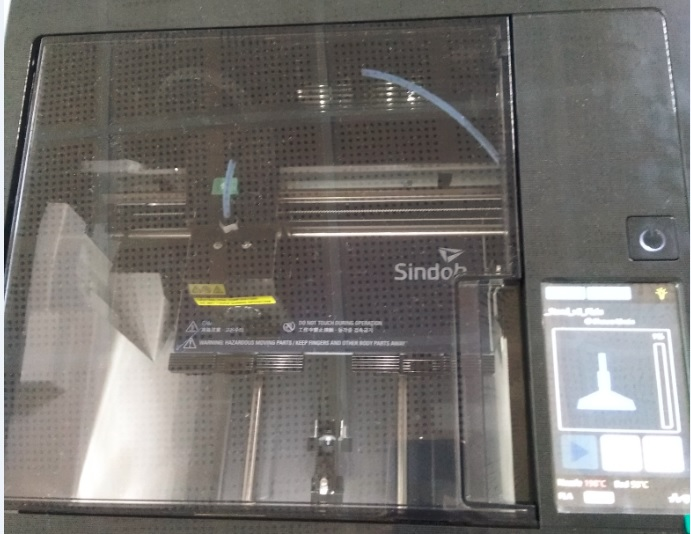
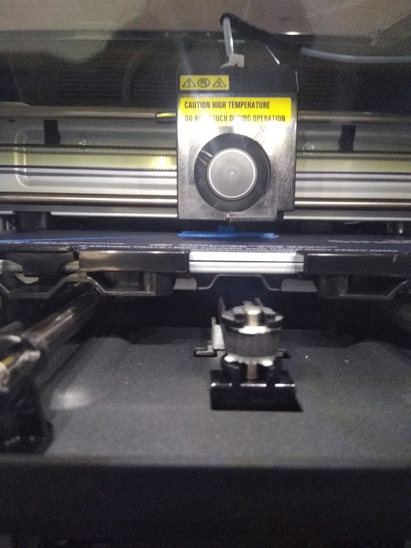
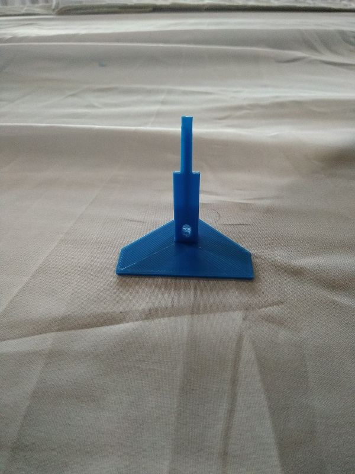
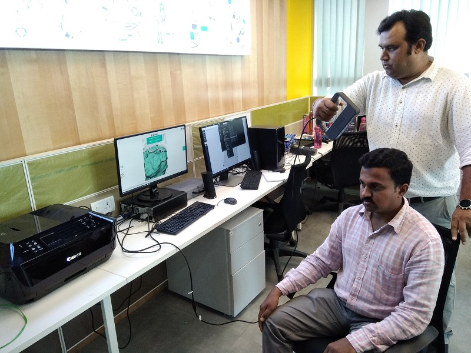
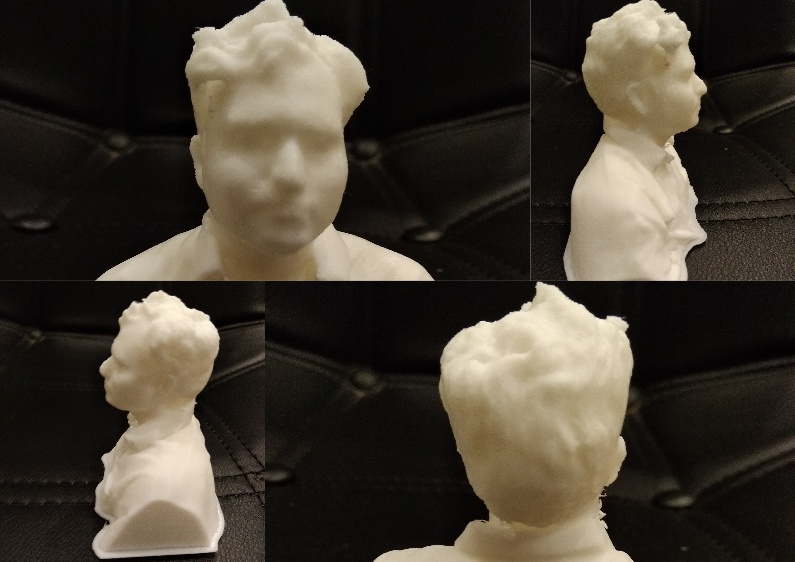
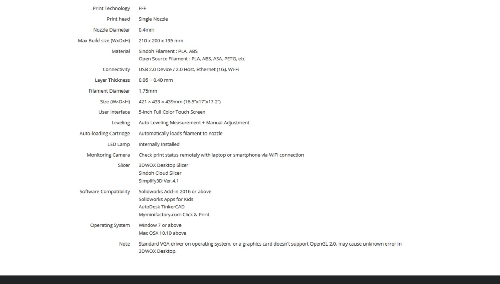

# Sindoh 3D WOX Printer  
 
3D printer which we have is a 0.4 mm dia. So Scale the object as per the requirement. If we scale below 0.4 mm dia the object don't print exactly.  
Object printing time is depend on size of the object going to print, if size is big it will print hours together. 
# Procedure for 3D print  
    --Open the 3D_WOX printer software and load the object which was designed in a software OR downloaded from the net.
    --Give the Print, it will calculate the printing duration and will display. 
    --Printer will display the object what is going to print on the screen.
    --Printer nozzle will be heated up to 200 degree C. Then printing will start.
    --After completion of print, properly we have to remove the bed and place it on a table for 2 min. to reduce the heat.
    --With the help of tool remove the object from the bed.

# Following is the object printed at FAB LAB (3D Image Download from the internet which is in STL format).  
 

 

 

 

 

 

# Following is the object printed at FAB LAB (3D Image created in the Freecad Software)(Yet to be printed)  

# **Sense Software**  

Sense is a 3D scanner software. The one which is scanned it can be printed in 3d WOX printer.

## Sense software features  

Real-time scanning of objects into 3D  
-	Set the scan volume based on what you are scanning  
-	Generate polygon meshes from the scan data  
-	Crop unwanted data  
-	Erase unwanted data  
-	Solidify the model to create a watertight, printable mesh  
-	Trim unwanted data  
-	Adjust colors  
-	Retouch areas of the model  
-	Share to Sketchfab and Facebook  
-	Save out data to STL, WRL, OBJ, and PLY formats for downstream use  

## Image of 3D scanner  
 

## Following images are scanned and printed at FAB LAB (3D Image scanned).  

### Sample image of 3D scanning using Sense.  
 

### Image of 3D print.  
 

## Click on following URL for detailed information  on 3D Sense  
https://www.3dsystems.com/shop/support/sense/videos

# Following are the Specifications of 3D WOX Printer 
 
## Click on below URL for complete details  
https://3dprinter.sindoh.com/en/product/dp200  

