# Roland Monofab SRM20 Milling Machine  
 
The SRM-20 portable milling machine can mill a broad range of materials, including modeling wax, chemical wood, foam, acrylic, poly acetate, ABS and PC board.  
Milling Made Easy with a User-Friendly VPanel. 
Following Softwares SRP Player, MODELA Player 4, ClickMill and SF Edit2 are require to editing, scaling and milling. 
# Procedure for PC board design and print  
--Open the KiCAD application. Go to File --> NEW---Click on Schematic Layout Editor 
--New Schema will open and then Select the components and Voltages with Proper connections. 
--Annotate schematic symbols  
--Run Electrical rules check  
--Assign PCB footprints to schematic symbols 
--Run PCBnew to layout printed circuit board  
--Draw thick copper routing between the components 
--Add Graphics line Edge.cuts  
--Select Plot and save in SVG format. While saving  
    *Select F.Cu and Edge.cuts in include layers  
    *Select Mirrored plot and Negative plot  
--Open both two files i.e. Trace and Cut in Inkscape software for convert SVG files to PNG file  
--Open fabmodules.org to convert from PNG to RML format to print the PCB in SRM20. 
--To print the PCB board, fix the 64 mm bit in SRM20 and move the bit using V plane software to origin point of PCB where circuit is going to start printing. And then click ORIGINATE. Set the X and Y Coordinates to 0 (zero). 
--Move the 64mm bit (in Z plane (up and down)) with help of yellanki, make the bit to touch the board and tight it. 
--In V Plane software set the Z axis coorinate 2mm (This is 2 mm above from PCB board).
--Then in V plane press CUT, a window will POP up. Delete the files which are displaying and add the Trace.rml file (Circuit design). Finally press OUTPUT button, then it will start milling the PCB. 
--After printed PCB, clean the bed with soft brush and replace the 64mm bit with 32mm bit. 
--Don't change X and Y ORIGINATE coordinates in V plane. Move the bit to starting point of PCB where CUT is going to start. Then help of yellanki make the bit to touch the board and tight it. 
--In V Plane software set the Z axis coordinate 2mm (This is 2 mm above from PCB board) and then click ORIGINATE. Set X and Y coordinates to 0 (zero).
--Then in V plane press CUT, a window will POP up. Delete the files which are displaying and add the CUT.rml file (Outer line of circuit). Finally press OUTPUT button, then it will start milling the outline. 
After finish the CUT, clean the bed with soft brush. With help of screw driver gently remove the PCB. PCB is ready. 
## Images of PC board design and Print  
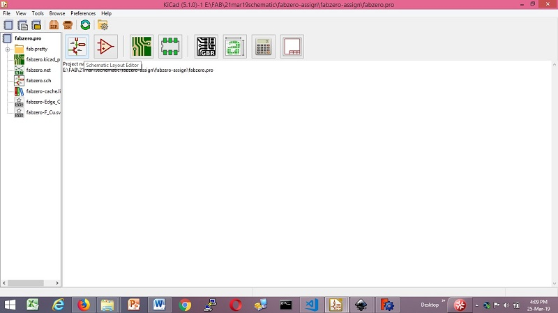 

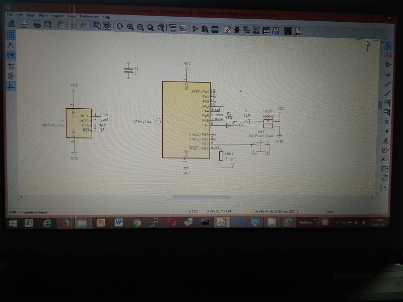 

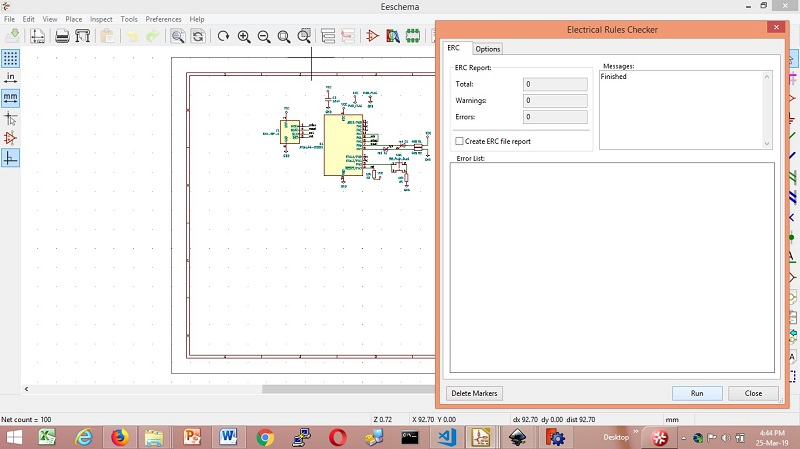 

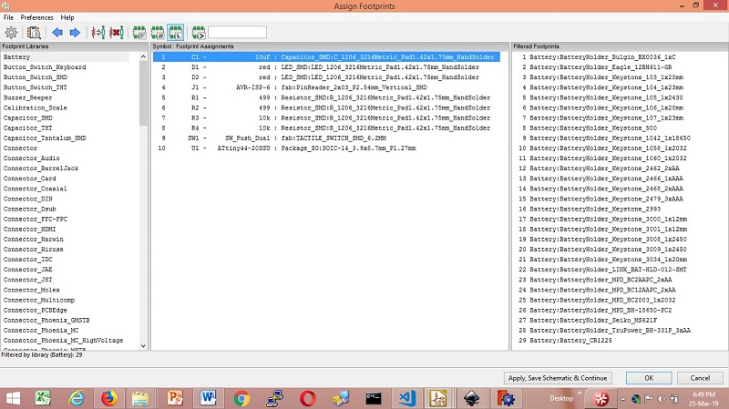 

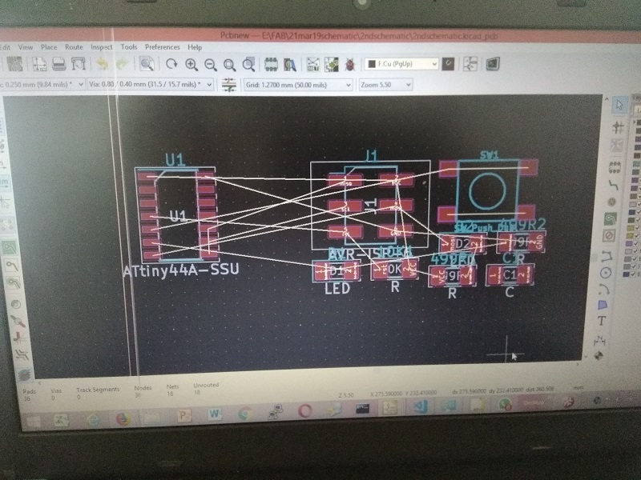 

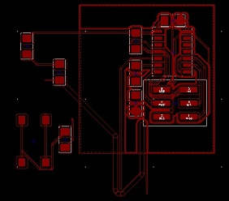 

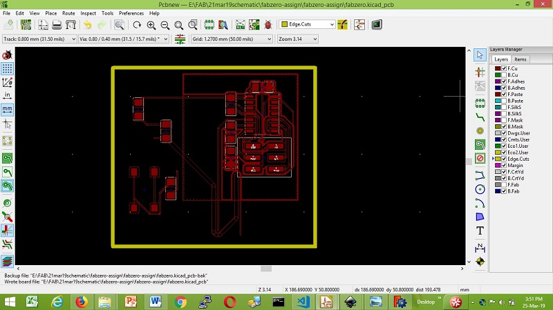 

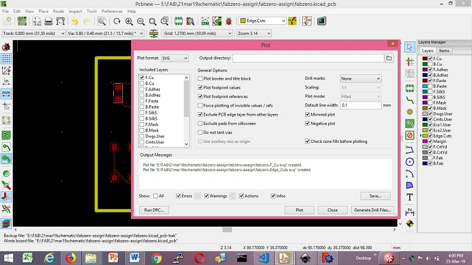 

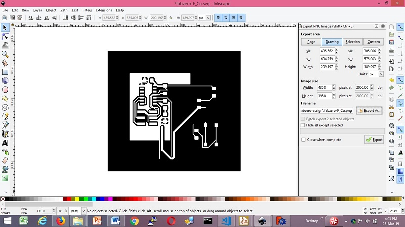 

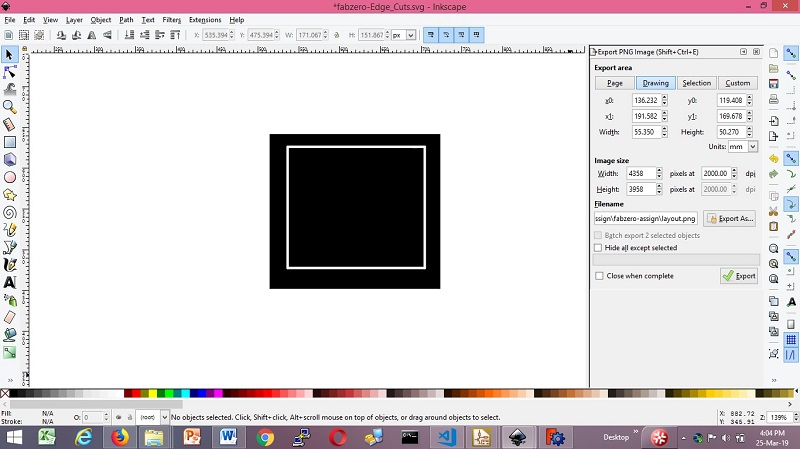 

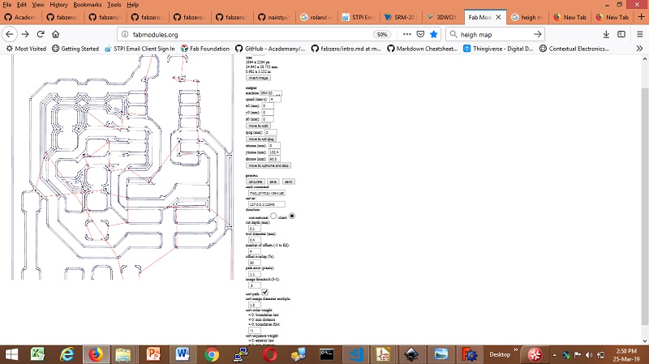 

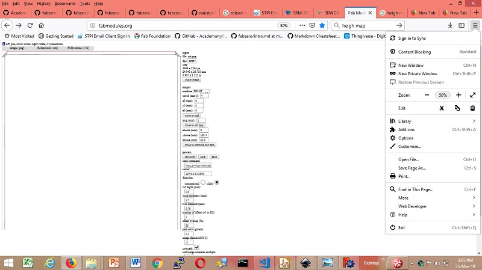 

## Following are images of PC board printed at FAB LAB.  

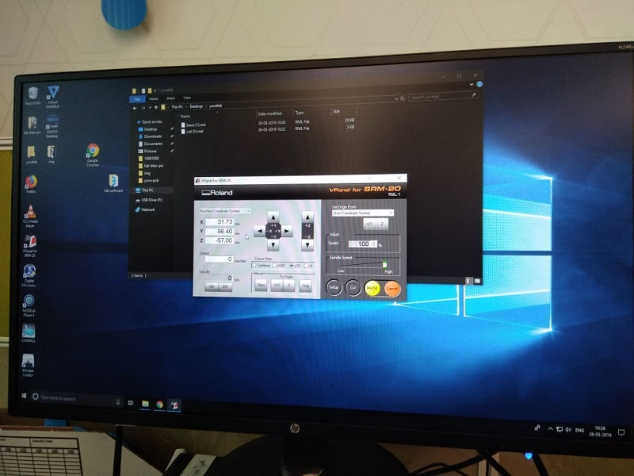 

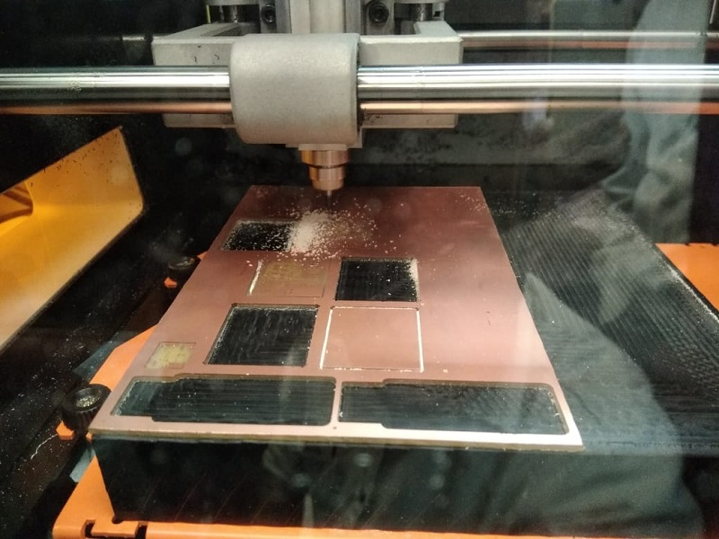 

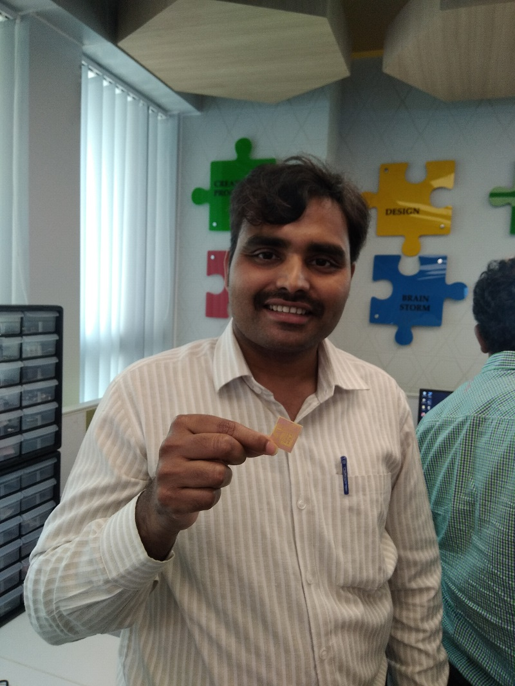 

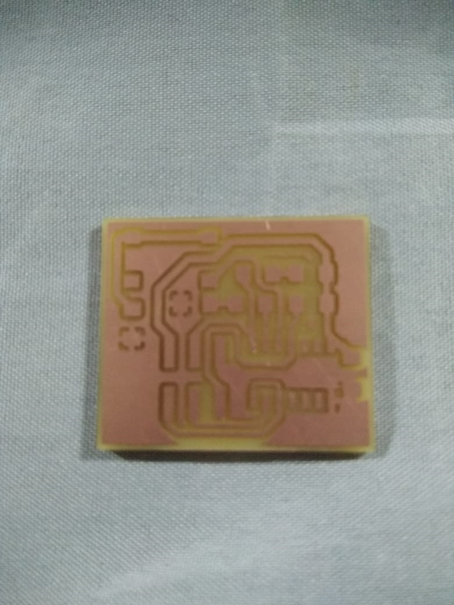 

