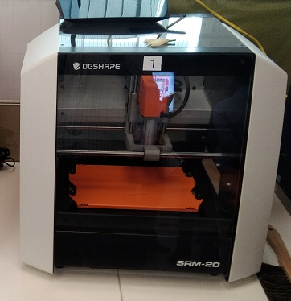

# Roland Monofab SRM20 Milling Machine  
 
The SRM-20 portable milling machine can mill a broad range of materials, including modeling wax, chemical wood, foam, acrylic, poly acetate, ABS and PC board.  
Milling Made Easy with a User-Friendly VPanel. 
Following Softwares SRP Player, MODELA Player 4, ClickMill and SF Edit2 are require to editing, scaling and milling. 
# Procedure for PC board print  
--Open the KiCAD application 
--File --> NEW 
--Click on Schematic Layout Editor 
--New Schema will open and then Select the components and Voltages with Proper connections. 
--Annotate schematic sysmbols  
--Run Electricals rules check  
--Assign PCB footprints to schematic symbols 
--Run PCBnew to layout printed circuit board  
--Draw thick copper routing between the components 
--Add Graphics line Edge.cuts  
--Select Plot and save in SVG format. While saving  
    -Select F.Cu and Edge.cuts in include layers  
    -Select Mirored plot and Negative plot  
--Open both two files i.e. Trace and Cut in Inkscape software for convert SVG files to PNG file  
--Open fabmodules.org to convert from PNG to RML format to print in SRM20

# Following is the PC board printed at FAB LAB.  

