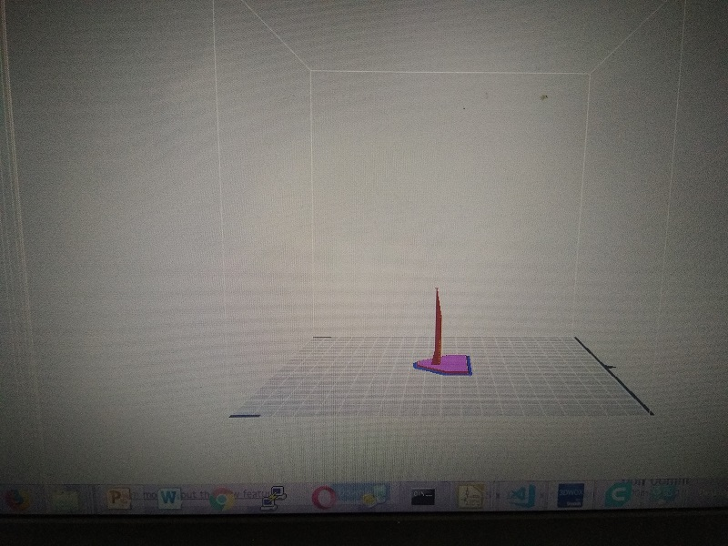
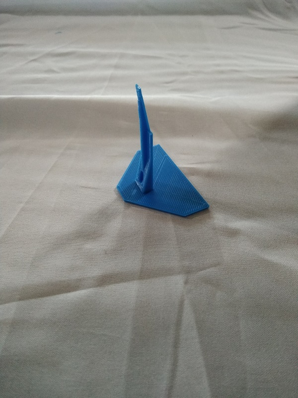
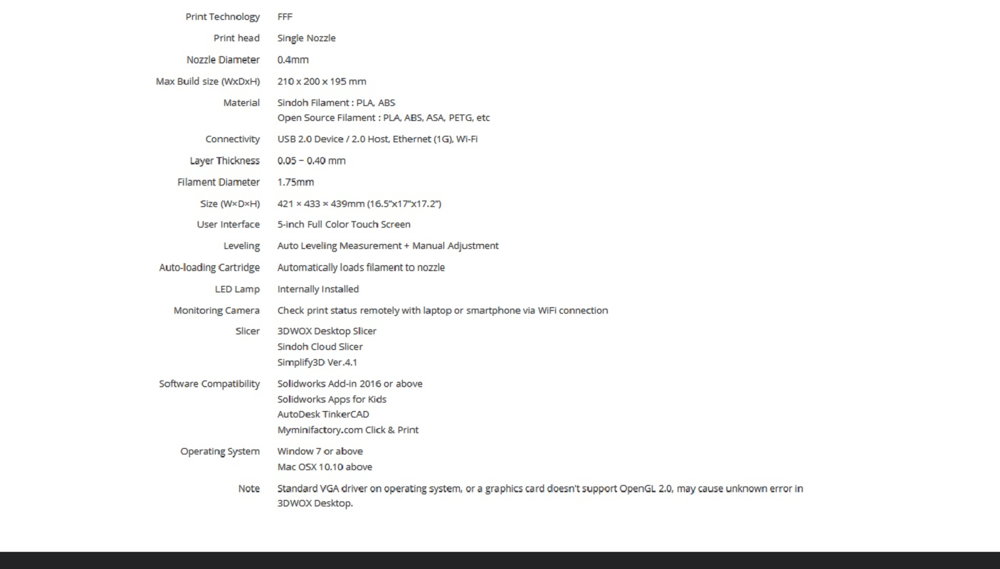

# Roland Monofab SRM20 Milling Machine  
 
The SRM-20 portable milling machine can mill a broad range of materials, including modeling wax, chemical wood, foam, acrylic, poly acetate, ABS and PC board.  
Milling Made Easy with a User-Friendly VPanel. 
Following Softwares SRP Player, MODELA Player 4, ClickMill and SF Edit2 are require to editing, scaling and milling. 
# Procedure for PC board print  
    --Open the 3D_WOX printer software and load the object which was designed in a software OR downloaded from the net.
    --Give the Print, it will calculate the printing duration and will display. 
    --Printer will display the object what is going to print on the screen.
    --Printer nozzle will be heated up to 200 degree C. Then printing will start.
    --After completion of print, properly we have to remove the bed and place it on a table for 2 min. to reduce the heat.
    --With the help of hand knife remove the object from the bed.

# Following is the PC board printed at FAB LAB.  
 

 

 

 

 

 

# Following are the Specifications of 3D WOX Printer 
 
## Click on below URL for complete details  
https://3dprinter.sindoh.com/product/3dwox1 

