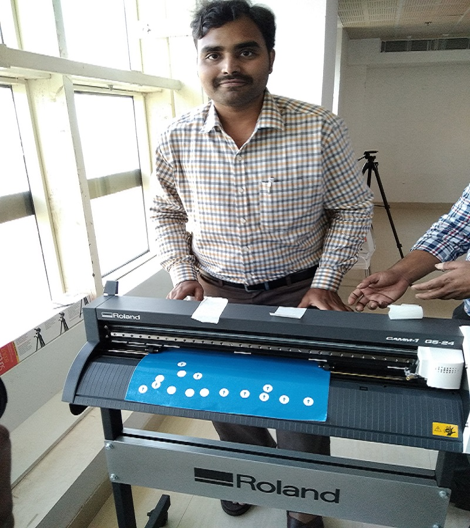

This is Mr.Yuvaraju. I am from STPI-Hyderabad. Working as Tech. Officer. 

I got oprtunity getting training on FAB LAB Pre-Academy Programme at STPI-Bhubaneswar. 

On 18th March 2019. This Pre-Academy training program is lanuched by Shri.Omkar Rai, DG, STPI. 

I met all other colleagues attending for the training. 

My traineers are Mr.Franchi and Mr.Sibu. Both are explaining well. 

In the afternoon along wit Mr.Franchi and Mr.Sibu we have visited FAB LAB two rooms. 

Mr.Franchie has brifed about the equipmentnts  

Roland Cutting Plotter  
 

3D WOX Printer  
 

EPILOG LASER, PUREX, 3D WOX Printer, Weller heat gun and soldering rod. 

FORMLABS 3D printing device. 
Shopboat wood cutter which runs at 14,000 rpm 
WEN and DeWALT equipment. 
On 19th March 2019 (2nd day) we have installed softwares Inkscape (2D Drawing), Cura (3D drawing) and Git Windows. 
Link of inkscape to download https://inkscape.org/release/inkscape-0.92.4/windows/64-bit/exe/dl/  
Link of Cura to download https://ultimaker.com/en/products/ultimaker-cura-software  
Link of Git Windows to download https://git-scm.com/download/win  

    --Open "New Window" in visual Studio Code
    --Copy the clone Address from Github
    --This is the command to see the clone address at Github "Control + Shift + P"
    --Clone address will pop up.Copy and Paste in Visual Studio Code at "Git: Clone"   
# Procedure for cutting the vnyl roler on Roland Cutter  

    --Place the vnyl roler on steel rolling roads properly
    --Align the vnyl roler paper parallel to the vertical lines of roland
    --Fix the small rolers at white marks. So that grip will be there to roll the vnyl roller
    --Also fix small roller 2mm inside the vnyl paper and other side edge of vnyl paper
    --So that paper can't be wasted.
    
# Following are the fixung the vnyl roler in the Roland machine  
 
 
