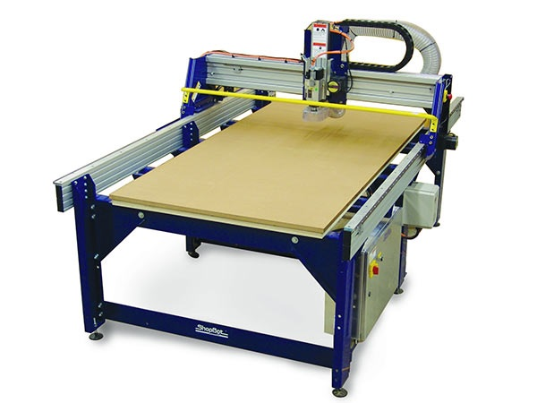

# Sindoh 3D WOX Printer  
  

Shopbot  Computer Numeric Control (CNC) tool is used in prototyping and full production for cutting, carving, machining and milling in wood, MDF, plastics, foams, and aluminum. The one we have is full size cutter i.e. means it can cut 4 feet X 8 feet sized wood boards.  

Shopbot CNC machine runs at 14,000 rpm. It has Dust catcher. 

It has two emergency STOP switches. One is on the x-axis and another remote switch. 

It consists two motors. One is used to move the along the x-axis and another to rotate spindle.   

Spindle in Z-axis positioned to zero with help of Eligator and Plate  

Precautions while using the machine  

--Two persons has to operate the machine  
--Should where Glasses to avoid dust going to eyes. 
--Should where Head set to avoid noise coming from the machine.  
--Should where Mask over the nose and mouth to avoid dust particles going to body.  

### Go through the below URL fo detailed information. 
https://support.shopbottools.com/products/alpha