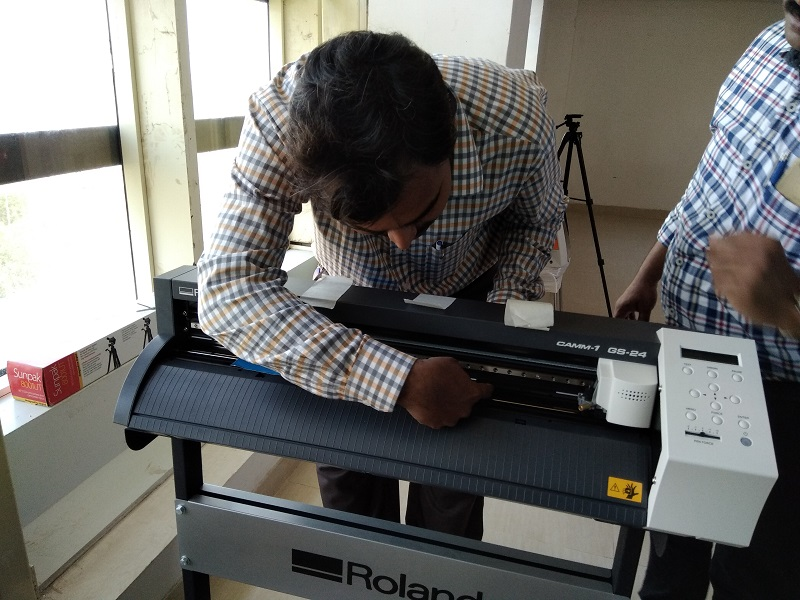
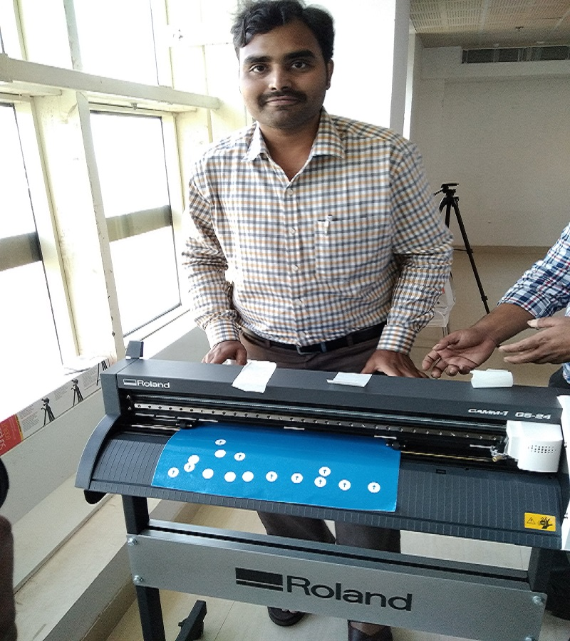
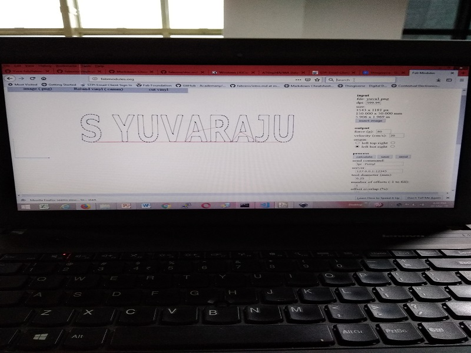
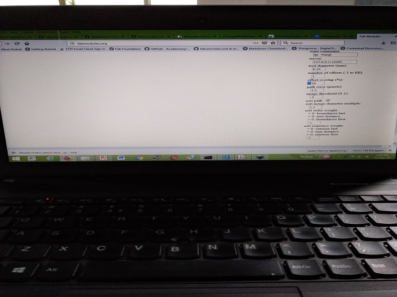

# Roland Cutting Plotter  
 
# Procedure for cutting the vnyl roler on Roland Cutter  

    --Place the vnyl roler on steel rolling roads properly
    --Align the vnyl roler paper parallel to the vertical lines of roland
    --Fix the small rolers at white marks. So that grip will be there to roll the vnyl roller
    --Also fix small roller 2mm inside the vnyl paper and other side edge of vnyl paper
    --So that paper can't be wasted.
    
# Following are the fixing the vnyl roler in the Roland machine  
 
 
# Name Sticker Printing
 
 
 