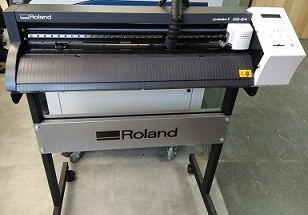

# Roland Vinyl Plotter  
 
 
 The one which have in the FAB LAB is Roland CAMM-1 GS 24 Vinyl cutter. A vinyl cutter is a type of computer-controlled machine. Small vinyl cutters look like a desktop printer. Like a printer controls a nozzle, the computer controls the movement of a sharp blade over the surface of the material. This blade is used to cut out shapes and letters from sheets of thin self-adhesive plastic (vinyl). The vinyl can then be stuck to a variety of surfaces depending on the adhesive and type of material. 

 The one major limitation with vinyl cutters is that they can only cut shapes from solid colours of vinyl. A design with multiple colours must have each colour cut separately and then layered on top of each other as it is applied to the substrate. Also, since the shapes are cut out of solid colours, photographs and gradients cannot be reproduced with a stand alone cutter.  

# Procedure for cutting the vinyl roller on Roland Cutter  

    --Place the vinyl roller on steel rolling roads properly
    --Align the vinyl roller paper parallel to the vertical lines of roland
    --Fix the small rollers at white marks. So that grip will be there to roll the vinyl roller
    --Also fix small roller 2mm inside the vinyl paper and other side edge of vinyl paper
    --So that paper can't be wasted.
    
# Following are the fixing the vinyl roller in the Roland machine  
 
 
# Name Sticker Printing 
 
 
 

Click on following URL for further details of Vinyl Cutter. 
https://www.rolanddga.com/products/vinyl-cutters/camm-1-gs-24-desktop-vinyl-cutter  